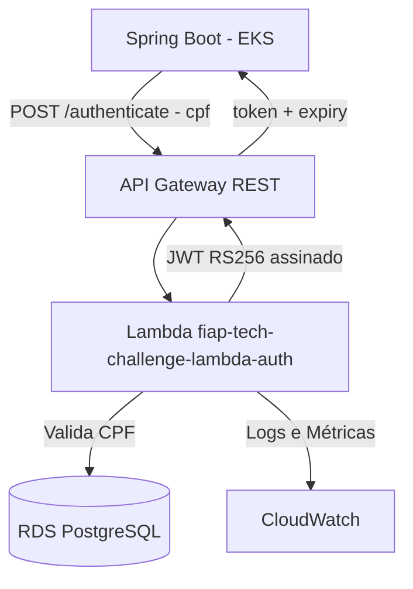

# fiap-tech-challenge-lambda-auth

## Propósito

Função AWS Lambda serverless que autentica usuários por CPF e gera JSON Web Tokens (JWT RS256). Exposta via AWS API Gateway REST, é consumida pela aplicação Spring Boot para autenticação sem estado.

**Faz parte do Tech Challenge Fase 3 — FIAP SOAT.**

## Arquitetura



## Tech Stack

- **Python 3.11** — runtime da Lambda
- **psycopg2** — conexão com PostgreSQL
- **PyJWT + cryptography** — geração de JWT RS256
- **Docker + Amazon ECR** — imagem container para a Lambda
- **Terraform** — provisionamento de Lambda, API Gateway e ECR
- **AWS API Gateway** (REST) — endpoint público `/authenticate`

## Estrutura do Projeto

```
.
├── src/
│   ├── handler.py        ← Entrypoint da Lambda
│   ├── auth_service.py   ← Lógica de autenticação (valida CPF, gera JWT)
│   ├── db_client.py      ← Conexão com RDS PostgreSQL
│   ├── jwt_generator.py  ← Assina o JWT com RS256 (private_key.pem)
│   ├── cpf_validator.py  ← Validação de CPF (dígitos verificadores)
│   └── logger.py         ← Logging estruturado
├── tests/
│   ├── test_handler.py
│   ├── test_jwt_generator.py
│   └── test_cpf_validator.py
├── terraform/            ← IaC para Lambda + API Gateway + ECR
├── scripts/              ← build.sh, deploy.sh, test-local.sh
├── Dockerfile            ← Imagem para deploy na AWS
├── Dockerfile.local      ← Imagem para testes locais
├── local_server.py       ← Servidor HTTP local para testes
└── requirements.txt
```

## Pré-requisitos

- [Python 3.11](https://www.python.org/)
- [Docker](https://www.docker.com/)
- [Terraform CLI](https://developer.hashicorp.com/terraform/downloads) >= 1.0
- [AWS CLI](https://aws.amazon.com/cli/) configurado
- Par de chaves RSA gerado (veja abaixo)
- Banco RDS PostgreSQL provisionado ([db-terraform](https://github.com/ThaisAzuos/fiap-tech-challenge-db-terraform))

> **Segurança**: `private_key.pem` e `public_key.pem` nunca devem ser commitados. Estão protegidos pelo `.gitignore`. A chave privada é passada como Secret do GitHub (`JWT_PRIVATE_KEY`) e a pública como Secret do app (`JWT_PUBLIC_KEY`).

## Gerar o par de chaves RSA

```bash
# Gerar chave privada (2048 bits)
openssl genrsa -out private_key.pem 2048

# Extrair chave pública
openssl rsa -in private_key.pem -pubout -out public_key.pem
```

- `private_key.pem` → usado pela Lambda para **assinar** o JWT
- `public_key.pem` → usado pelo Spring Boot para **validar** o JWT

## Quick Start (Local)

```bash
# 1. Instalar dependências
pip install -r requirements.txt pytest

# 2. Executar testes unitários
pytest tests/ -v

# 3. Subir servidor local (simula o API Gateway)
DB_HOST=localhost DB_NAME=oficina DB_USER=oficina_admin \
DB_PASSWORD=SuaSenha JWT_PRIVATE_KEY="$(cat private_key.pem)" \
python local_server.py
```

Testar localmente:

```bash
curl -X POST http://localhost:8080/authenticate \
  -H "Content-Type: application/json" \
  -d '{"cpf": "12345678901"}'
```

## API

**Endpoint:** `POST /authenticate`

**Request:**
```json
{ "cpf": "12345678901" }
```

**Response (200):**
```json
{
  "token": "eyJ...",
  "expiry": "2026-05-29T23:00:00Z"
}
```

**Response (401):**
```json
{ "error": "CPF not found or invalid" }
```

## URL de Produção

```
https://gs9sfvolq0.execute-api.us-east-1.amazonaws.com/prod/authenticate
```

## Deploy CI/CD (GitHub Actions)

O workflow `.github/workflows/main.yml` possui 2 jobs executados em sequência:

1. **build-and-test** — instala dependências Python, executa `pytest tests/ -v`
2. **terraform-deploy** — executado somente em push para `main`:
   - Configura credenciais AWS
   - `terraform init` com backend S3
   - `terraform validate`
   - Remove permissão Lambda e API Gateways orfãos (evita conflito no re-deploy)
   - `terraform import` da Lambda existente (idempotência)
   - `terraform apply -auto-approve`

**Secrets necessários no repositório:**

| Secret | Descrição |
|--------|-----------|
| `AWS_ACCESS_KEY_ID` | Credencial AWS |
| `AWS_SECRET_ACCESS_KEY` | Credencial AWS |
| `AWS_SESSION_TOKEN` | Token de sessão (AWS Academy) |
| `AWS_ACCOUNT_ID` | ID da conta AWS |
| `TF_STATE_BUCKET` | Nome do bucket S3 para o Terraform state |
| `DB_HOST` | Endpoint do RDS (output `db_address` do db-terraform) |
| `DB_NAME` | Nome do banco de dados |
| `DB_USER` | Usuário do banco de dados |
| `DB_PASSWORD` | Senha do banco de dados |
| `JWT_PRIVATE_KEY` | Chave privada RSA (conteúdo do `private_key.pem`) |

> Para atualizar as credenciais AWS em todos os repositórios de uma vez, use o script `C:\pos-fiap\fase3\update-aws-secrets.ps1`.

## Custo Estimado (AWS Academy)

| Recurso | Custo |
|---------|-------|
| Lambda (primeiras 1M invocações/mês) | gratuito |
| API Gateway (primeiras 1M chamadas/mês) | gratuito |
| ECR (armazenamento imagem ~50 MB) | < $0.01/mês |
| **Total estimado** | **~$0/mês** |

## Repositórios Relacionados

| Repo | Descrição |
|------|-----------|
| [fiap-tech-challenge-db-terraform](https://github.com/ThaisAzuos/fiap-tech-challenge-db-terraform) | Banco RDS — provisione antes deste repo |
| [fiap-tech-challenge-k8s-terraform](https://github.com/ThaisAzuos/fiap-tech-challenge-k8s-terraform) | Cluster EKS onde o app Spring Boot roda |
| [fiap-tech-challenge-app](https://github.com/ThaisAzuos/fiap-tech-challenge-app) | Aplicação Spring Boot — consome este endpoint |
